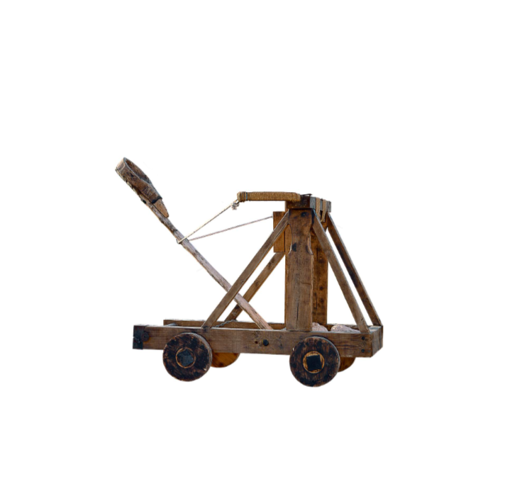

---
tags:
  - FTC
  - FRC
  - XRP
  - FIRST
  - Learning
---

# Lesson 1: Launcher Challenge

[Back to Lesson 1](xrp-engineering-design-process-lesson-1.md)

## Challenge

Build a launcher capable of launching a 3-inch bean bag between 18 and 24 inches.

## Required Setup

- A bean bag or another launchable item that will not roll away

## Suggested Materials

- Plastic spoons
- Rubber bands
- Cardboard or cardstock
- Popsicle sticks
- Tape or glue
- A 3-inch bean bag for testing

## Goal for Your Team

Create a launcher that sends the object the required distance with control and consistency.

## TODO

- Add a student worksheet for defining the problem, constraints, and success criteria.
- Add step-by-step build and testing instructions for the launcher challenge.
- Add a planning section for sketching launcher ideas and choosing materials.
- Add a test data table for recording launch distance, consistency, and design changes.
- Add reflection questions tied to the engineering design process used in Lesson 1.
