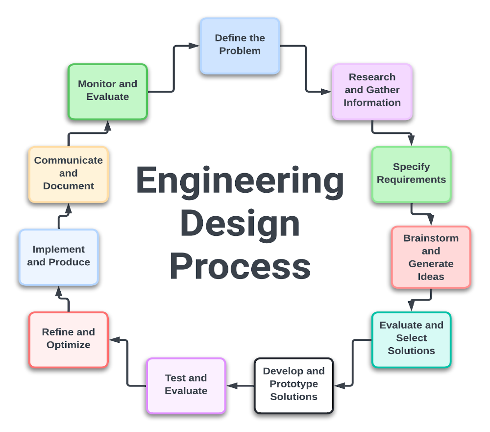
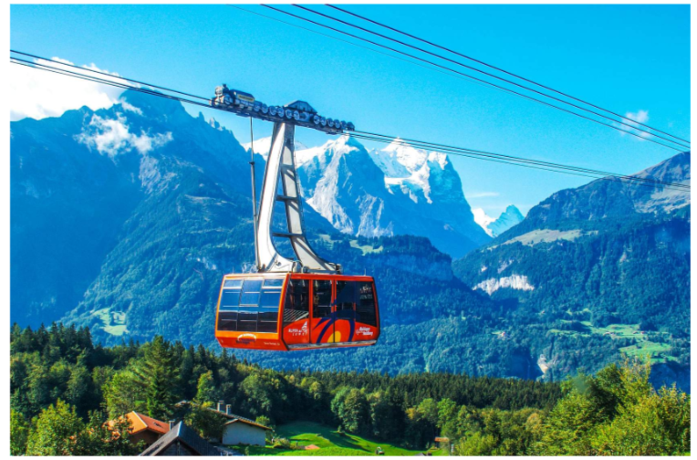

---
tags:
  - FTC
  - FRC
  - XRP
  - FIRST
  - Learning
---

# XRP Engineering Design Process Lesson 1

This page is a MkDocs-friendly conversion of the XRP Engineering Design Process Lesson 1 

Source deck:
- [Lesson 1 Student Slide Deck](https://info.firstinspires.org/hubfs/Education_Resources/XRP/Engineering_Design_Process/EDP-Facilitator-Guide.pdf)
- [Printable Flashcards PDF](../xrp-engineering-design-process-resources/lesson-1/EDP-L1-EDP-Flashcards.pdf)

## Overview

In this lesson, you will assess your problem-solving and initial understanding of the engineering design process and how to guide others through the process. You will complete an engineering design challenge while learning important collaboration and communication methods for facilitating this with others.

## Learning Outcomes

1. Understand how to actively engage in observations, share thoughts, and ask questions to better understand a task.

2. Understand how to collaborate effectively with others by setting clear goals, working toward them, and assessing our progress and teamwork.

3. Understand how to present as a group and reflect, using feedback to understand the steps of the engineering design process and how our work aligns with it.

## Materials Needed

- Engineering Design Process graphic
- Engineering Design Process flashcards
- See-Think-Wonder template
- Pens/pencils/markers
- Based on the design challenge chosen:
    - Drinking straws (non-bendy)
    - Plastic spoons
    - Cardboard sheets/scraps
    - Popsicle sticks
    - Cardstock
    - 8.5" x 11" paper
    - Rubber bands
    - Masking tape
    - Hot glue
    - Bean bag
    - Toy cars
    - 1 kg mass
    - Fishing line/string
    - Scissors

## Engineering Design Process

### Define the Problem

- **Identify the Need:** Understand and articulate the problem or need that requires a solution.
- **Problem Statement:** Create a clear and concise problem statement that outlines the challenge.
- **Constraints and Criteria:** Determine the constraints (limitations) and criteria (requirements) for the solution.

### Research and Gather Information

- **Background Research:** Conduct thorough research on the problem, including existing solutions, scientific principles, and relevant technologies.
- **Stakeholder Input:** Gather information from stakeholders (users, clients, experts) to understand their needs and preferences.

### Specify Requirements

- **Functional Requirements:** Define what the solution must do (its functions and features).
- **Non-functional Requirements:** Specify performance standards, reliability, safety, cost, and other non-functional aspects.
- **Design Criteria:** Establish the criteria that the final design must meet to be successful.

### Brainstorm and Generate Ideas

- **Idea Generation:** Brainstorm multiple potential solutions. Encourage creativity and consider a wide range of possibilities.
- **Team Collaboration:** Work in teams to combine diverse perspectives and expertise.

### Evaluate and Select Solutions

- **Concept Evaluation:** Assess each idea against the defined requirements and constraints.
- **Feasibility Analysis:** Consider factors such as technical feasibility, cost, time, and resources.
- **Decision Matrix:** Use a decision matrix or scoring system to compare and prioritize solutions.

### Develop and Prototype Solutions

- **Detailed Design:** Develop detailed designs for the selected solution, including drawings, specifications, and schematics.
- **Prototype Creation:** Build prototypes or models to test the design concept.
- **Testing and Iteration:** Test the prototypes to identify issues and refine the design through iterative cycles of testing and modification.

### Test and Evaluate

- **Performance Testing:** Conduct rigorous testing to ensure the solution meets all functional and non-functional requirements.
- **User Testing:** Involve end-users in testing to gather feedback and validate usability and effectiveness.
- **Analyze Results:** Analyze the test results to identify any remaining issues or areas for improvement.

### Refine and Optimize

- **Design Refinement:** Make necessary adjustments and optimizations based on testing feedback and performance data.
- **Cost-Benefit Analysis:** Reevaluate the solution in terms of cost, efficiency, and effectiveness.

### Implement and Produce

- **Final Design:** Finalize the design and prepare detailed documentation for manufacturing or implementation.
- **Production Planning:** Develop a plan for manufacturing, assembly, or deployment, considering logistics, quality control, and resource management.
- **Implementation:** Begin production or deployment of the solution.

### Communicate and Document

- **Documentation:** Create comprehensive documentation of the design process, including specifications, test results, and user manuals.
- **Present Findings:** Communicate the results and benefits of the solution to stakeholders through presentations, reports, and other media.

### Monitor and Evaluate (Post-Implementation)

- **Monitor Performance:** Continuously monitor the solution's performance in real-world conditions.
- **Maintenance and Updates:** Plan for regular maintenance and updates to address any emerging issues or improvements.
- **Feedback Loop:** Collect feedback from users and stakeholders to inform future design cycles.

## Choose Your Activity

Choose one challenge to begin. Each option opens its own page with the goal, setup, and required materials.

| Activity | Picture | Description |
| --- | --- | --- |
| [Cable Car Challenge](xrp-engineering-design-process-lesson-1-cable-car-challenge.md) |  | Design a cable car capable of traversing the width of the room with a 1 kg mass using miscellaneous materials. Must have a fishing line that is taped or tied the width of the room set at a 3 to 5 degree angle below normal of the wall from the starting point. |
| [Bridge Challenge](xrp-engineering-design-process-lesson-1-bridge-challenge.md) |  | Design a bridge that allows a small toy car to traverse the bridge but also supports a 1 kg mass. Must have two tables or supports set 18 inches apart and a small toy car. |
| [Launcher Challenge](xrp-engineering-design-process-lesson-1-launcher-challenge.md) |  | Build a launcher capable of launching a 3-inch bean bag between 18 and 24 inches. Must have a bean bag or another launchable item that will not roll away. | 

## Goal Setting

Before you start this current task, start by setting an effective goal or SMART goal for your use of time.

| Letter | Meaning | What It Means |
| --- | --- | --- |
| S | Specific | Include details of what you want to accomplish. |
| M | Measurable | Be able to measure your progress and determine if you've achieved your goal. |
| A | Achievable | Challenge yourself, but make sure the goal is realistic and possible to complete within the time frame. |
| R | Relevant | Align the goal with your values and long-term goals. |
| T | Time-Based | Set the goal within an appropriate time frame. |

The SMART method was developed to improve corporate planning and goal setting by setting clearer and more attainable targets. Using SMART goals can help you focus your efforts and increase your chances of achieving your goal.

### Example SMART Goal

"By the end of my allotted time, I will complete my build and gather my data for at least 3 of the tests for the design challenge chosen."

## Iteration

As you work through your challenge, your ideas may be successful, or they might lead to new hurdles. Continue to iterate your original ideas and solutions until you have one you feel is the best.

Create an additional SMART goal for improving your design.

Below are some questions to ask yourself during the process.

| Design Process Steps | Questions |
| --- | --- |
| Define the Problem | What problem are you trying to solve?  Why is this problem important to address?  Who will benefit from solving this problem?  What are the constraints and criteria for your solution? |
| Research and Gather Information | What do you already know about this problem?  What additional information do you need?  Where can you find reliable information about this topic?  What existing solutions or approaches have been tried? |
| Brainstorm Possible Solutions | What are some potential ways to solve this problem?  How can you think outside the box to come up with creative solutions?  What are the pros and cons of each potential solution?  How can you combine or modify ideas to improve them? |
| Select the Best Solution | Which solution do you think is the best? Why?  How does this solution meet the criteria and constraints?  What are the potential challenges or risks with this solution?  How will you know if this solution is successful? |
| Develop and Prototype | What materials and tools will you need to build your prototype?  What steps will you take to create your prototype?  How will you ensure accuracy and precision in your prototype?  How will you document the process of building your prototype? |
| Test and Evaluate | How will you test your prototype to see if it works?  What criteria will you use to evaluate your prototype?  What data will you collect during testing?  How will you analyze the results of your tests? |
| Improve and Refine | What did you learn from testing your prototype?  What worked well, and what didn't?  How can you improve your solution based on the test results?  What changes will you make to your prototype? |
| Communicate Results | How will you present your solution and findings?  What evidence will you use to support your conclusions?  How will you explain the process you followed and the decisions you made?  Who is your audience, and how can you tailor your presentation to them? |

### General Reflection Questions

- What was the most challenging part of the process for you?
- What did you learn about teamwork and collaboration?
- How did you overcome any obstacles or setbacks?
- What skills did you develop or improve during this project?
- How could you apply what you've learned to future projects or problems?

## Presentation | Share Out

Now that you have completed the task, an important part of reflection and learning is sharing what you accomplished. For the purpose of practice, create your own short graphic or illustration on your final design.
